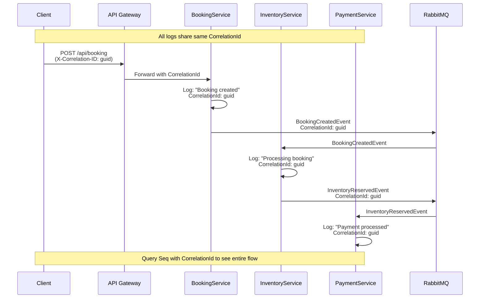

# Quick Reference: Correlation ID and System Testing

## Environment Setup

### Step 1: Copy Environment Files
```powershell
# For Docker deployment
Copy-Item .env.example .env

# For local development (optional)
Copy-Item .env.local.example .env.local
```

### Step 2: Start All Services
```powershell
# Build and start all containers
docker-compose up -d --build

# Check service health
docker-compose ps

# View logs for specific service
docker logs bookingservice --tail 50 -f
```

### Step 3: Verify Seq is Running
```powershell
# Open Seq dashboard
Start-Process "http://localhost:5341"
```

## Testing Complete Flow

### Reset Inventory Before Testing
```powershell
docker exec -it inventorydb psql -U inventoryservice -d inventorydb -c "
UPDATE \"InventoryReservations\" SET \"Status\" = 'RELEASED', \"ReleasedAt\" = NOW(); 
UPDATE \"InventoryItems\" SET \"AvailableQuantity\" = \"TotalQuantity\", \"ReservedQuantity\" = 0;
"
```

### Test Scenarios

#### 1. Basic Success Flow (4 bookings, low concurrency)
```powershell
.\scripts\testing\test-e2e-auth.ps1 -NumberOfFlows 4 -ConcurrentFlows 1
```
**Expected**: All bookings succeed (if payment succeeds)

#### 2. Inventory Exhaustion (8 bookings, high concurrency)
```powershell
.\scripts\testing\test-e2e-auth.ps1 -NumberOfFlows 8 -ConcurrentFlows 4
```
**Expected**: First 4 may succeed, rest fail with "Insufficient inventory"

#### 3. High Load Test (100 bookings)
```powershell
.\scripts\testing\test-e2e-auth.ps1 -NumberOfFlows 100 -ConcurrentFlows 10
```
**Expected**: Mix of success, payment failures (with retries), inventory failures

## Tracking Correlation IDs in Seq

### Finding a Correlation ID

1. Run a test and note the correlation ID from console output:
   ```
   [INFO] Flow #1 - Correlation ID: d6fd46e5-9831-4d11-97c3-af8fcb942f9c
   ```

2. Or find it in logs:
   ```powershell
   docker logs bookingservice | Select-String "CorrelationId"
   ```

### Querying in Seq

Open **Seq Dashboard** at `http://localhost:5341` and use these queries:

#### View All Events for a Single Transaction
```
CorrelationId = 'd6fd46e5-9831-4d11-97c3-af8fcb942f9c'
```

#### Timeline of Events
```sql
CorrelationId = 'd6fd46e5-9831-4d11-97c3-af8fcb942f9c'
| select @Timestamp, Service, @Level, @Message
| order by @Timestamp asc
```

#### Filter by Service
```sql
Service = 'BookingService' and CorrelationId = 'd6fd46e5-9831-4d11-97c3-af8fcb942f9c'
```

#### Find Payment Failures
```sql
Service = 'PaymentService' and @Message like '%FAILED%'
```

#### Find Inventory Warnings
```sql
Service = 'InventoryService' and @Level = 'Warning'
```

#### Track Event Publishing
```sql
@Message like '%Event published%' and CorrelationId = 'd6fd46e5-9831-4d11-97c3-af8fcb942f9c'
```

#### Client IP Tracking
```sql
ClientIp is not null
| select @Timestamp, Service, ClientIp, @Message
```

## Verifying System State

### Check All Containers
```powershell
docker ps --format "table {{.Names}}\t{{.Status}}\t{{.Ports}}"
```

### Check Database State

#### Bookings
```powershell
docker exec -it bookingdb psql -U bookingservice -d bookingdb -c "
SELECT id, status, cancellation_reason, created_at 
FROM bookings 
ORDER BY created_at DESC 
LIMIT 10;
"
```

#### Inventory
```powershell
docker exec -it inventorydb psql -U inventoryservice -d inventorydb -c '
SELECT "ItemId", "TotalQuantity", "AvailableQuantity", "ReservedQuantity" 
FROM "InventoryItems";
'
```

#### Outbox Messages
```powershell
docker exec -it bookingdb psql -U bookingservice -d bookingdb -c "
SELECT event_type, published, created_at, published_at 
FROM outbox_messages 
ORDER BY created_at DESC 
LIMIT 10;
"
```

### Check RabbitMQ Queues
```powershell
docker exec -it rabbitmq rabbitmqctl list_queues name messages
```

Or open **RabbitMQ Management UI**:
```powershell
Start-Process "http://localhost:15672"
# Credentials: guest/guest
```

## Common Correlation ID Patterns

### Success Flow Pattern in Seq
```
1. [BookingService] Booking created with ID: xxx
2. [BookingService] Event added to outbox: BookingCreated
3. [BookingService] Event published: BookingCreatedEvent
4. [InventoryService] Received BookingCreated event
5. [InventoryService] Processing BookingCreated for BookingId: xxx
6. [InventoryService] Inventory reserved for ROOM-XXX
7. [InventoryService] Event published: InventoryReservedEvent
8. [PaymentService] Received InventoryReserved event
9. [PaymentService] Payment processing for BookingId: xxx
10. [PaymentService] Payment succeeded: xxx
11. [PaymentService] Event published: PaymentSucceededEvent
12. [BookingService] Received PaymentSucceeded event
13. [BookingService] Booking xxx status updated to CONFIRMED
14. [InventoryService] Received PaymentSucceeded event
15. [InventoryService] Reservation confirmed for BookingId: xxx
```

### Inventory Failure Pattern in Seq
```
1. [BookingService] Booking created with ID: xxx
2. [BookingService] Event published: BookingCreatedEvent
3. [InventoryService] Received BookingCreated event
4. [InventoryService] WARNING: Insufficient inventory for ROOM-XXX
5. [InventoryService] Event published: InventoryReservationFailedEvent
6. [BookingService] Received InventoryReservationFailed event
7. [BookingService] Cancelling booking xxx due to inventory failure
8. [BookingService] Booking xxx cancelled
9. [BookingService] Event added to outbox: BookingCancelled
```

### Payment Failure Pattern in Seq
```
1-7. [Same as success flow through inventory reservation]
8. [PaymentService] Received InventoryReserved event
9. [PaymentService] Payment processing FAILED for BookingId: xxx
10. [PaymentService] Event published: PaymentFailedEvent
11. [InventoryService] Received PaymentFailed event
12. [InventoryService] Releasing inventory for BookingId: xxx
13. [InventoryService] Event published: InventoryReleasedEvent
14. [BookingService] Received PaymentFailed event
15. [BookingService] Booking xxx status updated to CANCELLED
```

## Troubleshooting

### No Correlation ID in Logs
**Check**:
1. Verify `Serilog.Enrichers.ClientInfo` package installed:
   ```powershell
   dotnet list src/BookingService/BookingService.csproj package | Select-String ClientInfo
   ```

2. Verify Program.cs has enrichers:
   ```csharp
   .Enrich.WithClientIp()
   .Enrich.WithCorrelationId()
   ```

3. Rebuild services:
   ```powershell
   docker-compose up -d --build bookingservice
   ```

### Events Not Flowing
**Check**:
1. RabbitMQ is running:
   ```powershell
   docker logs rabbitmq --tail 20
   ```

2. Consumers are listening:
   ```powershell
   docker logs inventoryservice | Select-String "listening to queue"
   ```

3. Queue has messages:
   ```powershell
   docker exec rabbitmq rabbitmqctl list_queues
   ```

### Seq Not Showing Logs
**Check**:
1. Seq container is running:
   ```powershell
   docker ps --filter "name=seq"
   ```

2. Services configured with correct Seq URL:
   ```powershell
   # In .env file
   SEQ_URL=http://seq:80
   ```

3. Restart services to reconnect:
   ```powershell
   docker-compose restart bookingservice paymentservice inventoryservice
   ```

## Quick Commands Cheat Sheet

```powershell
# Start system
docker-compose up -d --build

# Stop system
docker-compose down

# View all logs
docker-compose logs -f

# Reset inventory
docker exec -it inventorydb psql -U inventoryservice -d inventorydb -c "
UPDATE \"InventoryReservations\" SET \"Status\" = 'RELEASED'; 
UPDATE \"InventoryItems\" SET \"AvailableQuantity\" = \"TotalQuantity\", \"ReservedQuantity\" = 0;"

# Run test
.\scripts\testing\test-e2e-auth.ps1 -NumberOfFlows 10 -ConcurrentFlows 2

# Check RabbitMQ queues
docker exec rabbitmq rabbitmqctl list_queues name messages

# Check service health
Invoke-RestMethod -Uri "http://localhost:5000/health"

# Open dashboards
Start-Process "http://localhost:5341"      # Seq
Start-Process "http://localhost:15672"     # RabbitMQ
```

## Expected Correlation ID Flow



---

**Last Updated**: November 12, 2025
**Purpose**: Quick reference for testing and tracking correlation IDs
